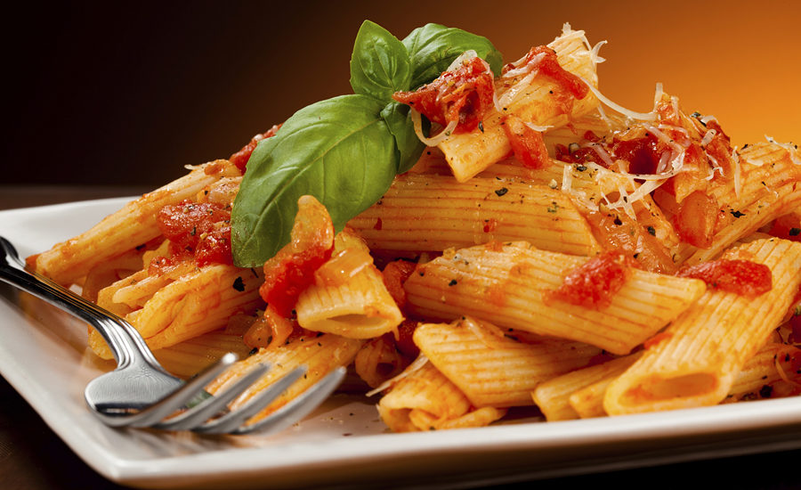

# Recipe-Website
<h1>Recipe search app </h1>

What I used to build this amazing project

  
Java script

Jquery

spoonacular API (https://spoonacular.com/food-api/console#Dashboard)

Bootstrap

CSS and HTML

## Read more about the recipe

## Live Version

Please follow this url to run my application: https://recipefood-4fe597.netlify.app/
